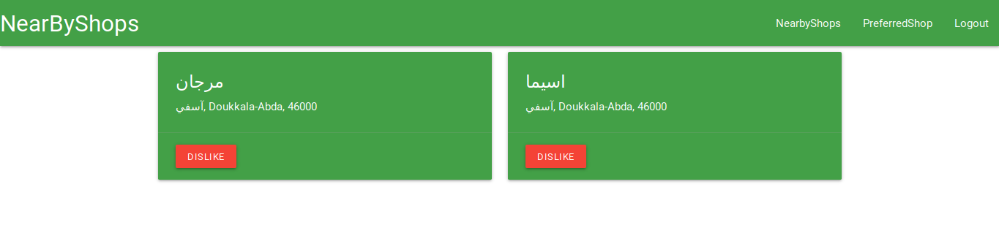
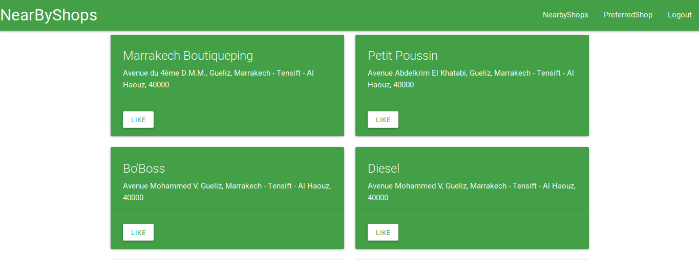

# code_challenge United Remote


> This an App developed in the United Remote hiring context help users to find shops that are near their location. and they can like shop to add on preference and remove them from preference. the user location is given by the ```HTML5``` geolocation API, you can take a lookk here [HTML5 Geolocation](https://developer.mozilla.org/fr/docs/Using_geolocation).

### Getting Started

To run the app on localhost, just clone the project and run ```npm install``` in both ```back-end``` and ```front-end``` directory. After that you can run the back-end API by running the command ```npm run dev | prod``` and launch front-end server using ```ng serve``` . Now you can access App by typing htpp://localhost:4200 in your browser.

### Prerequisites

Before running the App, you should make sure that you have ```mongodb```, ```Angular CLI``` and ```nodeJS``` install. there is some link that show how to install them. 

* [nodeJS](https://nodejs.org/en/download/package-manager/)
* [mongoDB](https://angular.io/guide/quickstart)
* [angular CLI]()

The back-end API also use TomTom api services to search the shops near by the connect user. you can take a look on their web site [TomTom Web site](https://www.tomtom.com/en_ma/). It can be a good alternative to google maps.


### Architecture

1. Back-end

The main logic of app is locate under ```/src``` folder. The code is written in TypeScript.

* [/config]()
    * [/cors.config.ts](./back-end/src/config/cors.config.ts)
    * [/database.config.ts](./back-end/src/config/database.config.ts)
    * [/jwt.config.ts](./back-end/src/config/database.config.ts)
* [/models]()
    * [/Shop.ts](./back-end/src/models/Shop.ts)
    * [/User.ts](./back-end/src/models/User.ts)
* [/routes]()
    * [authentication.ts](./back-end/src/routes/authentication.ts)
    * [shops.ts](./back-end/src/routes/shops.ts)
* [/app.ts](./back-end/src/app.ts)
* [/server.ts](./back-end/src/server.ts)

In subfolder config are located file to configure database, cors ([Cross-origin resource sharing](https://developer.mozilla.org/fr/docs/Web/HTTP/CORS)), and jwt ([JsonWebToken](https://github.com/auth0/node-jsonwebtoken)). cors is used to allow cross-origin request from front-end and jwt ([JsonWebToken]()) for authentication using token. data model are under models folder. Routing logic remain in routes folder and all the app is assembly in the ```app.ts``` file. The ```server.ts``` is just launch the server. All those files are compile and render under ```/dist``` folder into native Javascript.

2. Front-end

for the front-en the App has the global Architecture of an angular CLI project with component, services and guard.


## Screen shots



## Authors

* **Francis Djiomejoung** - *Initial work* - [Code Challenge](https://github.com/francisDYL/code_challenge)


## License

This project is licensed under the MIT License - see the [LICENSE.md](LICENSE.md) file for details

